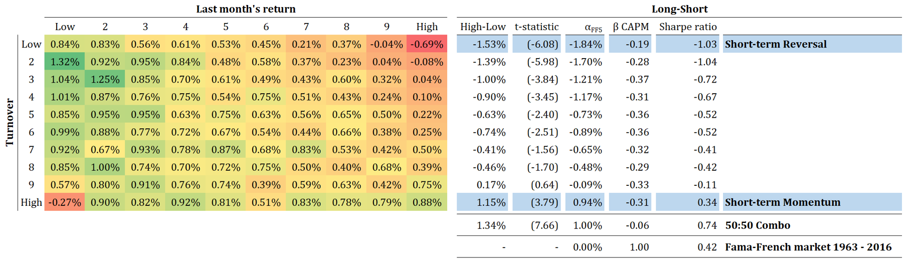
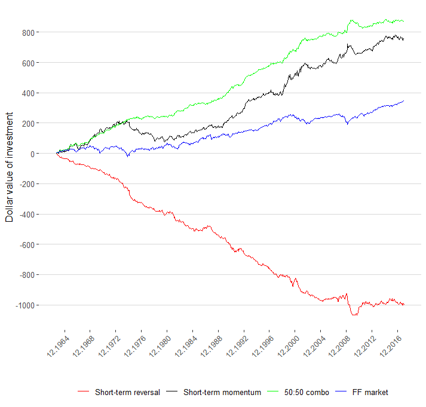

# Short-term Momentum trading strategy

Short-term momentum trading strategy implemented for the lecture "Systematic risk premia strategies traded at hedge funds" at University of Zurich, FS 2018.

---

## Overview

* Implementation in R
* In accordance to paper:

    + Monthly pricing data from the Center for Research in Security Prices (CRSP)

    + Sample starts in July, 1963 and ends in December, 2016
    + All common shares traded on NYSE, AMEX, and Nasdaq 
Measure short-term momentum using the return over the previous month: 𝑀𝑂𝑀_(𝑖,𝑡) = 𝑟_(𝑖,𝑡−1)

    + Measure short-term turnover using previous month volume and number of shares outstanding data: 𝑇𝑂_(𝑖,𝑡) = 𝑉𝑂𝐿_(𝑖,𝑡−1) / 𝑆𝐻𝑅𝑂𝑈𝑇_(𝑖,𝑡−1)

    + Portfolios are value-weighted by market capitalization and rebalanced at the end of each month

## Results

